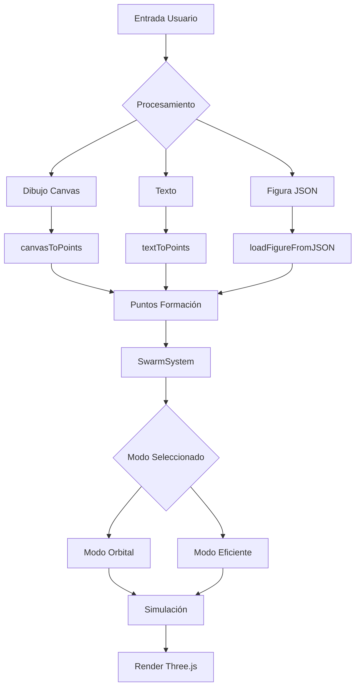

# Sistema de Simulación de Enjambre de Drones 3D

Un sistema interactivo de simulación de enjambres de drones que permite crear formaciones a partir de dibujos, texto y figuras predefinidas, con dos modos de operación y optimizaciones de rendimiento.

---

## Características Principales

- **Múltiples modos de entrada:** Dibujo manual, texto y figuras vectoriales  
- **Dos modos de operación:** Orbital (clásico) y Eficiente (optimizado)  
- **Procesamiento inteligente:** Algoritmos adaptativos para diferentes densidades  
- **Simulación 3D en tiempo real:** Usando Three.js  
- **Interfaz intuitiva:** Panel de control completo con atajos de teclado  
- **Optimizaciones de rendimiento:** Grid espacial, caché y gestión eficiente de memoria  

---

## Arquitectura del Sistema

### Módulos Principales

```text
src/
├── main.js              # Punto de entrada y gestión principal
├── config.js            # Configuración global y parámetros
├── drone.js             # Clase base Drone (comportamiento individual)
├── swarm.js             # Modo Orbital (enjambre clásico)
├── efficientSwarm.js    # Modo Eficiente (optimizado)
├── swarmModes.js        # Gestor de modos (SwarmSystem)
├── figureProcessor.js   # Procesador de figuras JSON
├── utils.js             # Utilidades canvas y texto
└── ui.js                # Interfaz de usuario y controles
```

## Diagrama de Flujo



## Algoritmos de Procesamiento

### 1. Procesamiento de Canvas (Dibujo Manual)

```javascript
// Pseudocódigo - Algoritmo adaptativo
function canvasToPoints(canvas):
    1. Obtener imagen del canvas (getImageData)
    2. Contar píxeles activos (alpha > 128)
    3. Calcular paso de muestreo basado en densidad:
       - Alta densidad (>6000 px): paso = 6
       - Media densidad (3000-6000 px): paso = 3
       - Baja densidad (<3000 px): paso = 2
    4. Recorrer imagen con paso calculado
    5. Convertir coordenadas a sistema centrado
    6. Retornar array de puntos {x, y}
```

### 1. Procesamiento de Texto

```javascript
// Pseudocódigo - Renderizado adaptativo
function textToPoints(text, canvas):
    1. Dividir texto en líneas no vacías
    2. Inicializar tamaño de fuente en 140px
    3. Ajustar tamaño para caber en canvas (90% espacio)
    4. Renderizar texto con Arial bold, centrado
    5. Aplicar canvasToPoints() al resultado
```

### 3. Procesamiento de Figuras JSON (128×128)

#### Tres Métodos Disponibles

| Método       | Descripción                          | Caso de Uso                    |
|-------------|--------------------------------------|---------------------------------|
| Exacto      | Procesa cada celda `'1'`             | Máxima precisión                |
| Inteligente | Muestreo adaptativo (~1000 pts)      | Balance rendimiento/calidad     |
| Bordes      | Solo contornos de figura             | Efectos artísticos              |

#### Algoritmo Inteligente (predeterminado)

```javascript
function processMatrix128Intelligent(matrix, targetPoints, scale, spacing):
    1. Contar total de celdas '1'
    2. Calcular factorMuestreo = total / targetPoints
    3. Recorrer matriz tomando cada factorMuestreo-ésima celda
    4. Aplicar escala y centrado
    5. Usar grid para evitar puntos muy cercanos
    6. Retornar puntos distribuidos uniformemente
```

## Comportamiento de los Drones

### Clase Drone - Atributos Principales

```javascript
class Drone {
    // Geometría y Render
    mesh: THREE.Mesh              // Objeto 3D (círculo)
    originalColor: number         // Color base
    orbitColor: number = 0x00ffff // Color en órbita
    
    // Posición y Movimiento
    position: THREE.Vector3       // Posición actual
    target: THREE.Vector3         // Objetivo actual
    velocity: THREE.Vector3       // Velocidad actual
    homePosition: THREE.Vector3   // Posición inicial (modo eficiente)
    
    // Estado
    isOrbiting: boolean           // En órbita (modo orbital)
    isActive: boolean             // En formación (modo eficiente)
    
    // Parámetros de Comportamiento
    maxSpeed: number = 1.5
    alignmentFactor: number = 0.1  // Alineación con vecinos
    cohesionFactor: number = 0.05  // Cohesión de grupo
}
```

### Sistema de Colisiones y Flocking

```javascript
// Algoritmo de Colisiones
resolveCollisions(neighbors):
    Para cada vecino:
        distancia = posición actual - posición vecino
        Si distancia < espacioPersonal:
            fuerza = ((espacioPersonal - distancia) / espacioPersonal)²
            fuerzaRepulsión = fuerza * separaciónFuerza
            Aplicar fuerza en dirección opuesta

// Algoritmo de Flocking Básico
applyFlocking(neighbors):
    velocidadMedia = promedio(velocidades vecinos)
    velocidadActual += (velocidadMedia - velocidadActual) * factorAlineación
```

## Nodos de Operacion

### Nodo Orbital Swarm.js

#### Características
- Todos los drones siempre activos  
- Drones no utilizados orbitan en patrones concéntricos  
- Comportamiento de flocking completo  
- Ideal para visualizaciones 

### Algoritmo de Órbita

```javascript
updateOrbitalTarget(drone, index):
    radio = radioBase + (index % 8) * 25
    velocidad = velocidadBase + (index % 13) * 0.003
    ángulo = tiempoÓrbita * velocidad + index * 0.15
    
    drone.target.x = centro.x + cos(ángulo) * radio
    drone.target.y = centro.y + sin(ángulo) * radio
```

### Modo Eficiente (`EfficientSwarm.js`)

#### Características

- Drones organizados en cuadrícula cuando inactivos  
- Solo los drones en formación se actualizan completamente  
- Optimización de rendimiento para grandes cantidades de drones  
- Menor consumo de CPU  

#### Organización

```javascript
// Configuración de cuadrícula
dronesPorFila: 25
espaciado: 12
posiciónInicialY: -300  // Parte baja de pantalla

// Estados
activeDrones: Drone[]    // Drones en formación
drones: Drone[]          // Todos los drones (activos + inactivos)
```
## Optimizaciones de Rendimiento

### 1. Grid Espacial para Colisiones

```javascript
// Reduce complejidad de O(n²) a O(n)
class SpatialGrid {
    cellSize = espacioPersonal * 3
    
    updateGrid():
        Para cada dron:
            celdaX = floor(posición.x / cellSize)
            celdaY = floor(posición.y / cellSize)
            clave = `${celdaX},${celdaY}`
            
            Si grid[clave] no existe:
                grid[clave] = []
            
            grid[clave].push(dron)
    
    getNeighbors(dron):
        Retornar drones en celda actual + 8 celdas vecinas
}
```

### 2. Sistema de Cache

```javascript
// Cache de figuras procesadas
const figureCache = new Map()
claveCache = `${nombreFigura}_${cantidadDrones}`

// Cache de instancias de modo
modes = {
    'orbital': instanciaSwarm,
    'efficient': instanciaEfficientSwarm
}
```

### 3. Gestion de Memoria

```javascript
dispose():
    1. Remover meshes de la escena Three.js
    2. Llamar geometry.dispose() y material.dispose()
    3. Limpiar arrays y referencias
    4. Forzar garbage collection si disponible
```

## Interfaz de Usuario

### Panel de Control

#### Secciones Principales

- **Figuras Predefinidas:** Botones 1-4 para cargar figuras JSON  
- **Dibujo Manual:** Canvas interactivo + botones de acción  
- **Texto:** Campo de entrada + botón de conversión  
- **Modo de Enjambre:** Selector entre modo Orbital y Eficiente  
- **Parámetros:** Sliders para ajustes en tiempo real  
- **Gestión de Drones:** Control de cantidad y visualización de estadísticas  

---

### Atajos de Teclado

| Tecla   | Acción         | Descripción                                 |
|----------|---------------|---------------------------------------------|
| 1-4      | Figuras       | Cargar figuras predefinidas                 |
| Espacio  | Limpiar       | Limpiar canvas y formación                  |
| T        | Texto         | Aplicar texto actual                        |
| D        | Dibujo        | Aplicar dibujo del canvas                   |
| R        | Random        | Desordenar formación                        |
| C        | Centrar       | Agrupar en el centro                        |
| X        | Colisiones    | Alternar sistema de colisiones              |
| Ctrl++   | Escalar +     | Aumentar tamaño de formación 20%            |
| Ctrl+-   | Escalar -     | Reducir tamaño de formación 20%             |
| F5       | Reset Escala  | Restaurar tamaño original                   |

---

### Controles por Slider

| Parámetro         | Rango        | Efecto                                      |
|------------------|-------------|----------------------------------------------|
| Velocidad        | 0.01–0.2    | Velocidad general de movimiento              |
| Radio Órbita     | 50–300      | Radio de órbita (modo orbital)               |
| Velocidad Órbita | 0.001–0.05  | Velocidad angular de la órbita               |
| Espacio Personal | 5–20        | Distancia mínima entre drones                |
| Fuerza Separación| 0.1–2.0     | Intensidad del sistema de colisiones         |

## Configuracion

### Parametros Golbales config.js

```javascript
const params = {
    // Rendimiento
    droneCount: 800,             // Cantidad total de drones
    droneSpeed: 0.07,            // Velocidad base
    
    // Órbita
    baseRadius: 120,             // Radio base de órbita
    baseOrbitSpeed: 0.015,       // Velocidad angular base
    
    // Colisiones
    collisionsEnabled: true,     // Sistema de colisiones
    personalSpace: 8,            // Distancia mínima
    separationForce: 0.5,        // Fuerza de repulsión
    
    // Display
    width: window.innerWidth,    // Ancho ventana
    height: window.innerHeight,  // Alto ventana
    
    // Estado
    currentFigure: null          // Figura actual seleccionada
}
```

### Configuracion de FIguras

```javascript
const figureConfigs = {
    'mascara': {
        jsonFile: 'figures/mascara.json',
        scale: 3.0,              // Escala inicial
        spacing: 3.0,            // Espaciado entre puntos
        color: 0xFF5733,         // Color RGB
        name: 'Máscara',         // Nombre para mostrar
        method: 'intelligent'    // Método de procesamiento
    },
    // ... más figuras
}
```
## API de Clases

### SwarnSystem (Controlador Principal)

```javascript
class SwarmSystem {
    // Propiedades
    scene: THREE.Scene           // Escena Three.js
    mode: 'orbital' | 'efficient' // Modo actual
    activeMode: Swarm | EfficientSwarm
    drones: Drone[]              // Referencia a drones activos
    
    // Métodos Principales
    setMode(mode)                // Cambiar modo de operación
    setFormation(points, color, figureName) // Establecer formación
    update()                     // Actualizar simulación
    dispose()                    // Liberar recursos
    getStats()                   // Obtener estadísticas
    
    // Propiedades Computadas
    get currentPoints()          // Puntos actuales de formación
    get currentFigureName()      // Nombre de figura actual
}
```
### Metodo de Utilidad

```javascript
// utils.js
export function canvasToPoints(canvas)        // Canvas → puntos
export function textToPoints(text, canvas)    // Texto → puntos

// figureProcessor.js
export async function loadFigureFromJSON(name, droneCount) // Cargar figura
```

## Instalacion y Uso

### Requisitos

- Navegador moderno con WebGL
- Servidor web para cargar archivos JSON
- (Opcional) Node.js para desarrollo

### Estructura de Archivos
```
proyecto/
├── index.html                  # Página principal
├── figures/                    # Figuras en formato JSON
│   ├── mascara.json
│   ├── logo_escuela.json
│   ├── logo_universidad.json
│   └── estrella.json
├── css/
│   └── styles.css             # Estilos de interfaz
└── js/                        # Código fuente (modulos ES6)
    ├── main.js
    ├── config.js
    ├── drone.js
    ├── swarm.js
    ├── efficientSwarm.js
    ├── swarmModes.js
    ├── figureProcessor.js
    ├── utils.js
    └── ui.js
```

### Configuracion Inicial

1. Configurar figuras: Agregar archivos JSON en carpeta figures/
1. Definir configuración: Modificar figureConfigs en config.js
1. Ajustar parámetros: Modificar params según necesidades
1. Personalizar UI: Modificar ui.js para controles adicionales

### Ejemplo de Uso Basico

```javascript
// Inicialización desde main.js
init() {
    // 1. Crear escena Three.js
    const scene = new THREE.Scene();
    
    // 2. Configurar cámara y renderer
    const camera = new THREE.OrthographicCamera(...);
    const renderer = new THREE.WebGLRenderer(...);
    
    // 3. Crear sistema de enjambre
    let swarm = new SwarmSystem(scene, params.droneCount);
    
    // 4. Configurar interfaz
    setupUI(swarm, recreateSwarm);
    
    // 5. Iniciar animación
    function animate() {
        swarm.update();
        renderer.render(scene, camera);
        requestAnimationFrame(animate);
    }
    animate();
}
```

### Renimineto y Optimizacion

1. Grid Espacial: Colisiones O(n) en lugar de O(n²)
1. Diferencia Activo/Inactivo: Solo drones necesarios se actualizan completamente
1. Cache de Figuras: Evita reprocesamiento
1. Limpieza Eficiente: Proper disposal de recursos Three.js
1. Renderizado Selectivo: Modo eficiente minimiza actualizaciones

### Métricas de Rendimiento

| Cantidad de Drones | Modo Orbital | Modo Eficiente | Mejora |
|--------------------|--------------|----------------|--------|
| 500 drones         | ~45 fps      | ~60 fps        | +33%   |
| 1000 drones        | ~25 fps      | ~45 fps        | +80%   |
| 2000 drones        | ~12 fps      | ~30 fps        | +150%  |

---

### Características Pendientes

- Exportar formaciones a JSON/CSV  
- Importar trayectorias desde archivos  
- Sistema de partículas para efectos visuales  
- Modo grabación/reproducción de secuencias  
- Simulación física más realista  
- Pathfinding para evitar obstáculos  

---

## Imagenes del Programa
### Modos de Comportamiento


### Dashboard


### Input Texto


### Input Imagen predeterminada


### Input DIbujo


### Controles y Atuajos


